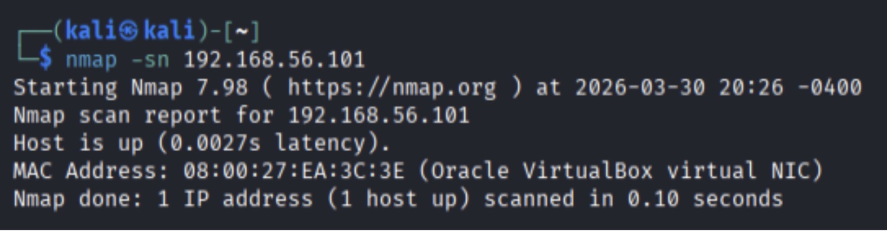
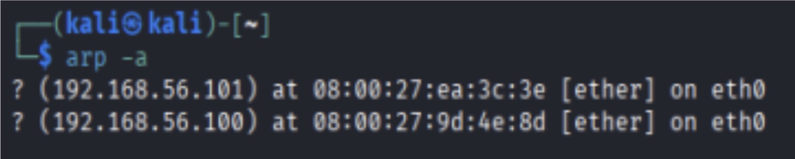
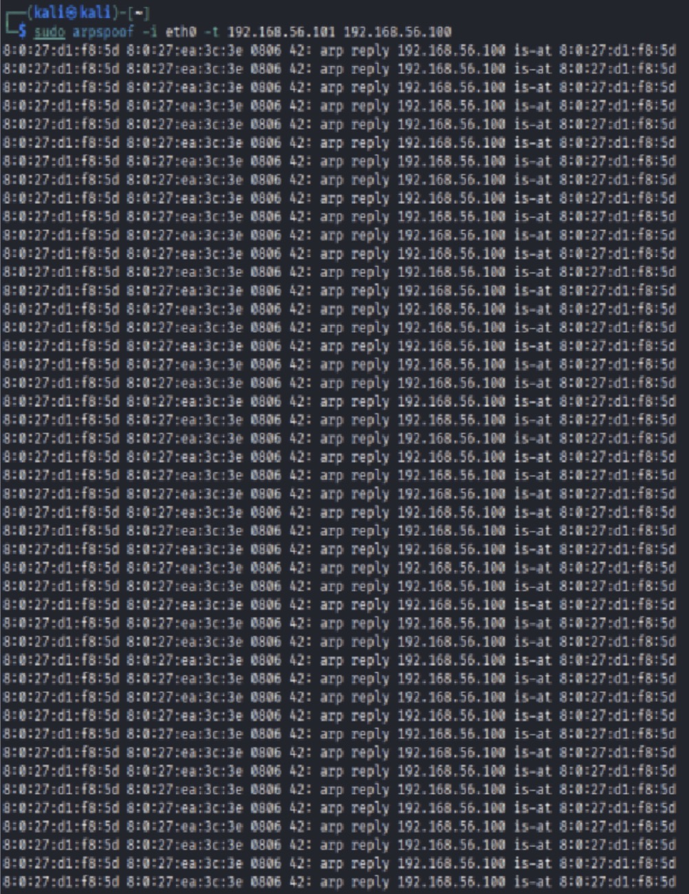
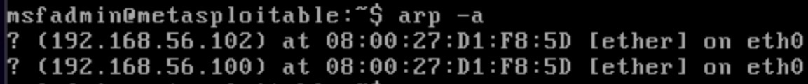
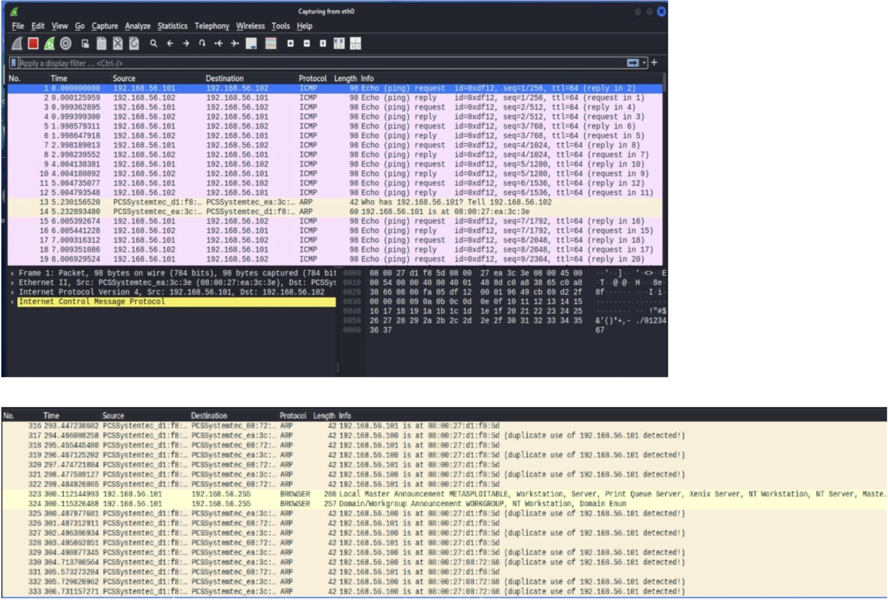
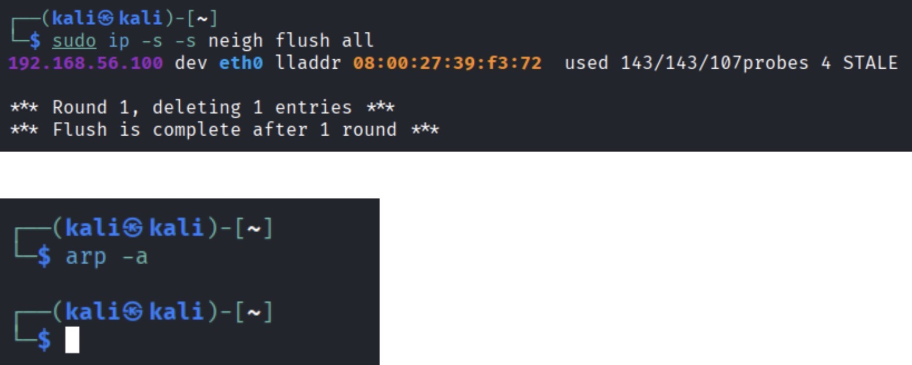

# 🔐 ARP Poisoning & MITM Attack Analysis

A cybersecurity project that explores how ARP Poisoning can affect communication within a local network and enable a Man-in-the-Middle (MITM) attack.

## 📌 About the Project

The project was conducted in a controlled virtual lab using Kali Linux as the analyst machine and Metasploitable 2 as the target.

The main objective was to observe how ARP table manipulation can redirect network traffic and allow traffic interception.

## 🧰 Tools Used

- Kali Linux
- Metasploitable 2
- Wireshark
- Nmap
- arpspoof
- VirtualBox

## 🔍 Project Steps

1. Network & ARP Table Analysis
   - Verified that the target was reachable using Nmap.
   - Examined the ARP table and IP-to-MAC mappings.

2. ARP Poisoning
   - Performed ARP poisoning in the controlled lab environment.
   - Compared the ARP table before and after the attack.

3. Traffic Interception
   - Captured network traffic using Wireshark.
   - Analyzed ARP and TCP traffic during the attack.

4. Defense Mechanisms
   - Explored Static ARP Entries.
   - Explored Dynamic ARP Inspection (DAI).
   - Considered ARP monitoring and encrypted protocols such as HTTPS and SSH.

5. Network Restoration
   - Stopped the ARP poisoning process.
   - Cleared the ARP cache.
   - Verified that the network returned to a clean state.

## 📸 Screenshots

### Nmap Scan

### ARP Table Before the Attack

### ARP Poisoning

### ARP Table After the Attack

### Wireshark Traffic Analysis

### ARP Table Restoration

## 🛡️ Security Takeaways

This project demonstrated how ARP poisoning can manipulate IP-to-MAC mappings and redirect traffic. It also explored security mechanisms that can help detect or prevent ARP poisoning attacks.

## ⚠️ Disclaimer

This project was conducted in a controlled virtual lab environment for educational and cybersecurity learning purposes.
